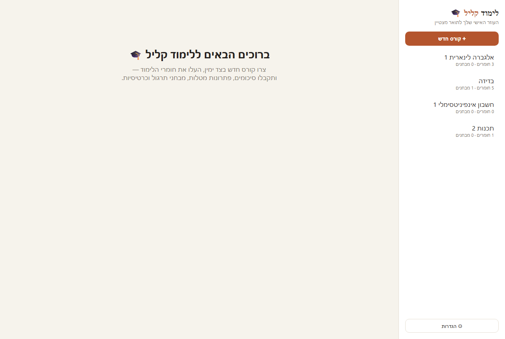
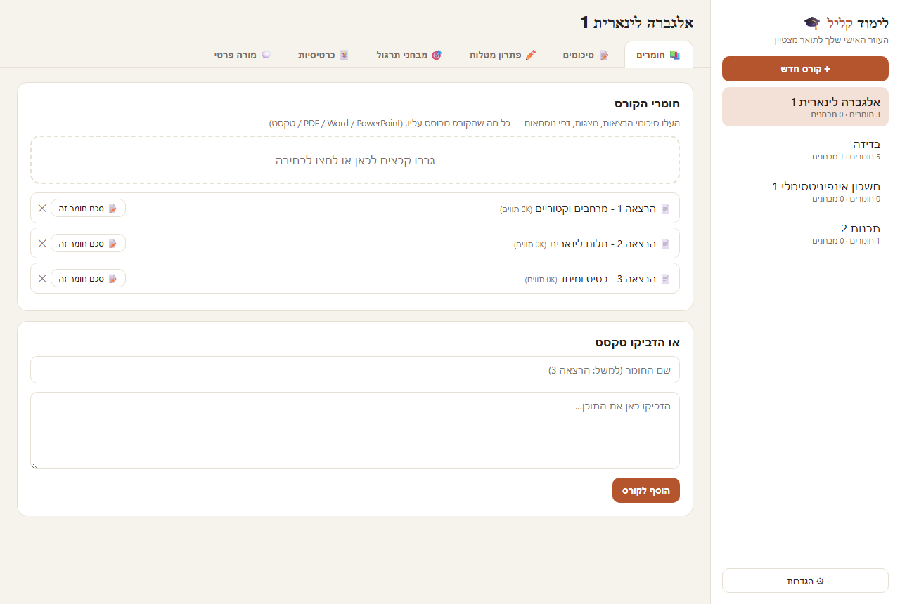
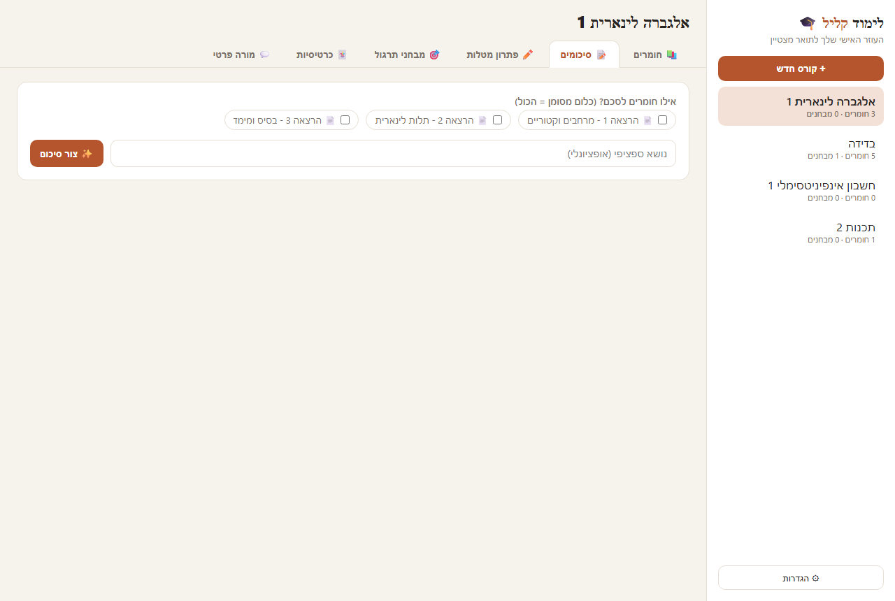

# לימוד קליל 🎓

**עוזר הלימודים האישי שלך — סיכומים, פתרון מטלות, מבחני תרגול וכרטיסיות, מבוסס בינה מלאכותית.**

תוכנה למחשב (Windows) שעוזרת לך ללמוד חכם יותר ולהיות סטודנט/ית מצטיין/ת.

---

## ⬇️ הורדה

להורדת הגרסה האחרונה: [**עברו לעמוד ה-Releases**](../../releases/latest) והורידו את `LimodKalil-Setup.zip`.

לאחר ההורדה: חלצו את ה-ZIP והריצו את `LimodKalil.exe`.

> בהפעלה הראשונה Windows עשוי להציג "Windows protected your PC" — זה נורמלי לתוכנה חדשה. לחצו **More info** ואז **Run anyway**.

---

## 📸 איך זה נראה

---

## ✨ מה התוכנה עושה

| | |
|---|---|
| 📝 **סיכומים חכמים** | סיכום מסודר של החומר, עם נקודות מפתח ושאלות לבדיקה עצמית |
| ✏️ **פתרון מטלות** | פתרון צעד-אחר-צעד עם הסברים — אפשר גם להעלות צילום של דף תרגילים |
| 🎯 **מבחני תרגול** | מבחן ברמת סוף סמסטר, עם ציון ומשוב על כל שאלה |
| 🃏 **כרטיסיות זיכרון** | לשינון מהיר של מושגים ונוסחאות |
| 💬 **מורה פרטי** | צ'אט שמכיר את חומרי הקורס שלך ועונה על כל שאלה |

---

## 🔑 מה צריך כדי להשתמש

חשבון Claude. אפשר להתחבר באחת משתי דרכים (בוחרים בהגדרות ⚙):

- **חשבון Claude שלך (Pro/Max)** — מתחברים פעם אחת, בלי מפתח ובלי תשלום נוסף. דורש את התוכנה הרשמית Claude Code.
- **מפתח API** — מדביקים מפתח מ-[platform.claude.com](https://platform.claude.com); השימוש לפי המחירון של Anthropic.

בכל מקרה הפרטים נשמרים רק במחשב שלך, ובסרגל הצד יש **מד ניצול** שמראה כמה השתמשת החודש.

---

*כל הזכויות שמורות.*
